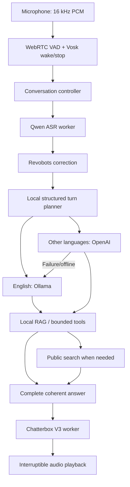

# Patrick / Revobots voice assistant

Patrick is a multilingual robot voice-assistant prototype. The wake phrase is **Hey Scout**; its identity is **Patrick**, created by Aditya Raj as part of Revobots. The robot hardware interface is currently simulated.

The maintained speech stack is **Qwen3-ASR 0.6B + Chatterbox Multilingual V3**. English questions expecting English answers use **Ollama Qwen3.5** in hybrid mode; other input/reply language combinations use OpenAI, with local fallback. Local RAG supplies approved Revobots facts. Public web search is optional and separate from private RAG.

This standalone project targets **Orin NX 16 GB / Linux aarch64**. Begin with [Jetson migration](docs/jetson-migration.md). It contains no real keys, installed environments or model weights. Copy `.env.example` to `.env` and configure it after preserving the working Conda Torch/Torchvision builds. See `PROJECT_HANDOFF.md` for continuation notes.

## Run

Activate your application environment and run from the project root:

```text
python -m patrick devices
python -m patrick text --provider hybrid
python -m patrick voice --provider hybrid --headphones --no-barge-in
python -m unittest discover -s tests
```

Add `--input-device N` or `--output-device N` using the device list. Omit output selection for the default speaker. Do not copy Windows device indices to Linux.

Text mode accepts `Hey Scout ...`, follow-up questions, `/state`, `/metrics`, and `/quit`. During voice playback, say **stop**, pause, and ask the next question. `--no-barge-in` disables ordinary speech interruption but keeps the recognized stop path active. Stop spotting still uses an English Vosk model.

For loudspeakers, configure and test actual OS/hardware acoustic echo cancellation, then use `--echo-cancelled`. That flag declares an existing AEC setup; it does not enable AEC. Echo/noise can still cause recognition errors. Do not remove Vosk: Qwen ASR handles complete questions, while Vosk handles wake/stop and endpoint spotting.

## Architecture



The controller owns `IDLE -> LISTENING -> PROCESSING -> SPEAKING` transitions. A local wake activates a timed conversation session. Speech is captured continuously into bounded buffers; local silence rules decide when to submit an utterance. Stop/cancellation invalidates the active turn and clears queued audio. Late model and synthesis output is discarded.

A submitted turn snapshots PCM, transcribes off the capture/control thread, corrects company-name variants, removes only the wake prefix and preserves Unicode. Hybrid planning classifies question language, requested answer language and search need locally. It adds a short inference before generation; the current 2B desktop checks took roughly 0.3 seconds, not a Jetson performance guarantee.

The chosen backend receives the identity/rules prompt, recent complete exchanges and relevant RAG evidence. Current facts or explicit public lookups can trigger search before the final response. Tool rounds/calls, transport deadlines, queue sizes and response lengths are bounded. Hybrid buffers final answers so failed backends do not produce conflicting partial spoken replies. Progress speech such as **Ummm, let me check.** passes through before search and is excluded from answer memory.

Speech output is cleaned for spoken text and split into useful chunks. The persistent multilingual TTS worker selects a supported language, synthesizes a complete WAV for each chunk, and the playback worker renders it. This is chunked synthesis, not a native token-streaming TTS API. Model initialization/warmup happens before opening the microphone.

## Environments and dependencies

One activated app environment is enough for daily use. Two speech workers are necessary with the current packages:

| Environment | Purpose | Dependency boundary |
|---|---|---|
| `chatbot` (Windows / Jetson Conda) | Application, audio, HTTP clients, RAG, playback | No Transformers requirement |
| `.qwen-asr-env` | Qwen3-ASR | Transformers 4.57.6 |
| `.chatterbox-env` | Chatterbox Multilingual V3 | Transformers 5.2.0 |
| Ollama service | Local LLM and routing | Native HTTP server, outside Python |

The worker environments can share a platform-matched Torch foundation through system site-packages. They cannot share one Transformers installation with these conflicting pins. Do not merge them by suppressing dependency checks. Default interpreter paths select `Scripts/python.exe` on Windows and `bin/python` on Linux. `QWEN_ASR_PYTHON` and `CHATTERBOX_PYTHON` can override the worker locations.

Python 3.10+ is supported; 3.10 uses `tomli`. Requirements are deliberately split:

- `requirements.txt`: app and microphone dependencies.
- `requirements-qwen-asr-runtime.txt`: ASR worker dependencies.
- `requirements-qwen-asr.txt`: pinned core, installed separately with `--no-deps` after its runtime.
- `requirements-chatterbox-runtime.txt`: TTS worker dependencies.
- `requirements-chatterbox-v3.txt`: pinned official V3 source, installed with `--no-deps` to preserve the selected CUDA Torch build.
- `deploy/constraints-orin-torch.txt`: fixed Jetson Torch **2.14.1+cu132** and Torchvision **0.29.1+cu132**; use the Jetson guide to preserve installed Torchaudio too.

Legacy Whisper, Kokoro and Qwen-TTS adapters, requirements and environment settings were removed. Their weights had already been removed. Existing working environments, shared packages, active V3/ASR models, Vosk, Q8 experiment and rollback backups are retained.

## Settings

Copy `.env.example` to `.env` only for a new setup. Never overwrite existing keys. `.env` lives beside `patrick.toml`; `--env-file PATH` overrides it. Shell variables take precedence. Restart after edits. The Jetson template is `deploy/orin-nx.env.example`.

| Setting | Meaning |
|---|---|
| `DEFAULT_PROVIDER` | `hybrid`, `local`, `openai`, legacy `auto`/`gemini`, or simulated `offline` |
| `LOCAL_MODEL`, `LOCAL_BASE_URL`, `LOCAL_API` | Installed Ollama tag, URL, and native `ollama` or compatible `openai` transport |
| `OPENAI_API_KEY`, `OPENAI_MODEL` | Cloud answer/search credentials and available model |
| `LOCAL_TEMPERATURE=0.4`, `LOCAL_TOP_P=0.95` | Answer sampling; variety does not guarantee correctness |
| `LOCAL_PRESENCE_PENALTY=0` | No presence penalty |
| `LOCAL_NUM_PREDICT=384` | Maximum generated answer tokens |
| `LOCAL_CONTEXT_LENGTH` | Desktop 32768; Jetson starting profile 8192; `full` queries model metadata |
| `LOCAL_KEEP_ALIVE=30m` | How long Ollama keeps the model loaded |
| `PROVIDER_TIMEOUT_SECONDS`, `LOCAL_TIMEOUT_SECONDS` | Cloud/local attempt deadlines |
| `HYBRID_ROUTER_TIMEOUT_SECONDS=10` | Local classification deadline; failure uses conservative cloud/local fallback |
| `HYBRID_OFFLINE_RETRY_SECONDS=30` | Cloud/search cooldown after detected network failure |
| `SESSION_MEMORY_EXCHANGES=3` | Bounded complete user/assistant pairs; 0 disables memory; idle clears it |
| `SYSTEM_PROMPT_FILE` | Optional prompt override; default `patrick/system_prompt.txt` |
| `RAG_KNOWLEDGE_FILE` | Default `knowledge/revobots.json`; empty disables retrieval |
| `WEB_SEARCH_ENABLED`, `WEB_SEARCH_PROVIDER`, `WEB_SEARCH_MODEL` | Enable public OpenAI/Tavily search and select its model/backend |
| `SEARCH_TIMEOUT_SECONDS`, `SEARCH_ACK_TEXT` | Search deadline and progress speech |
| `STT_ENGINE` | `qwen` for complete question transcription; `vosk` for diagnostic English-only transcription |
| `QWEN_ASR_MODEL`, `QWEN_ASR_DEVICE` | Default Qwen3-ASR 0.6B and CUDA device |
| `QWEN_ASR_DTYPE` | `auto`, `float16`, `bfloat16`, `float32`; current worker does not implement INT8 |
| `QWEN_ASR_LANGUAGE=auto` | Detect question language; optionally force one |
| `TTS_ENGINE` | `chatterbox`; `system` is an OS speech diagnostic fallback |
| `CHATTERBOX_DEVICE`, `CHATTERBOX_CPU_THREADS`, `CHATTERBOX_WARMUP` | TTS device, CPU threading and startup warmup |
| `CHATTERBOX_LANGUAGE=auto` | Speech language selection; ASR input language is a hint, explicit reply language is honored |
| `CHATTERBOX_REFERENCE_AUDIO`, `CHATTERBOX_MODEL_PATH` | Optional reference WAV and local V3 checkpoint override |
| `QWEN_ASR_PYTHON`, `CHATTERBOX_PYTHON` | Optional absolute worker interpreter overrides |

`patrick.toml` owns wake phrase, 15-second session timeout, silence timings, 30-second utterance limit, speech/barge-in confirmation, emergency phrases, 16 kHz sample rate, 20 ms frames and VAD aggressiveness. `--no-barge-in` overrides ordinary interruption behavior for that run. `--model` is for single-provider mode; configure each backend separately in hybrid/auto.

## RAG, prompts, web and memory

The approved JSON knowledge base uses local BM25 keyword retrieval. The main LLM receives relevant excerpts as untrusted evidence and can call local `knowledge_search` with English keywords to retrieve additional facts, then answer in the requested language. RAG is not fine-tuning, persistent conversation memory or proof of live camera/sensor access. Names, numbers and qualifications must stay accurate when paraphrasing.

`system_prompt.txt` defines Patrick's identity, safety boundaries, honesty and conversational style. Improve it by stating a clear rule once, separating connected runtime capabilities from documented hardware, and testing representative conversations. Avoid repeating stock Q&A scripts when you want natural phrasing. The current app has no connected movement, live vision, telemetry or calculator. Prompting and temperature do not guarantee correct math or perfect tool selection.

Hybrid selects Ollama only when the question and expected answer are English; other combinations select OpenAI. Explicit answer-language requests are classified semantically, not with a list of question phrases. Search is for public current facts or explicit lookups; general stable explanations need not search. English answers still come from Ollama even when OpenAI supplies search. Offline fallback must disclose that current facts cannot be verified. Private excerpts must not be sent to public search. See [hybrid behavior and module reference](docs/hybrid-routing.md).

`text_normalization.correct_terms()` normalizes Riverbots, Rivabots, Riverboards and bounded sound-alike families to Revobots before routing/retrieval/generation in voice and text. It preserves ordinary words such as robots and riverboats. These are spelling corrections, not hardcoded answers.

Memory stores only recent successful, complete user/assistant pairs in RAM; it excludes RAG excerpts, tool payloads and progress acknowledgements. It is cleared on session timeout. No conversation transcript is persisted by memory, though application logs can contain transcripts/replies. History crosses hybrid backend switches.

## Code map

The full [module/function index](docs/code-reference.md) links to every current callable, including internal callbacks.

| File | Responsibility |
|---|---|
| `cli.py`, `__main__.py` | CLI/environment setup, text/voice/devices/demo entry points |
| `config.py`, `environment.py` | Validate TOML configuration; load `.env` without exposing secrets |
| `ports.py` | Provider/playback/robot/audio contracts and response metadata |
| `controller.py` | State machine, session timing, cancellation, interruption, metrics |
| `endpoint.py` | Local wake normalization and adaptive utterance endpoint rules |
| `audio.py` | Capture callback, bounded PCM buffers, VAD, Vosk wake/stop, ASR submission |
| `transcription.py` | Async utterance transcription, wake-prefix removal, normalization, language metadata |
| `qwen_asr.py` | Persistent Qwen ASR subprocess, JSON/PCM protocol and precision selection |
| `text_normalization.py` | Shared Revobots spelling corrections |
| `turn_planning.py` | Local structured language/search classification |
| `hybrid.py`, `failover.py` | Per-turn backend policy, bounded attempts, offline cooldown, coherent replies |
| `providers.py`, `ollama_settings.py` | HTTP streaming/tool replay, bounded memory, native Ollama options |
| `knowledge.py` | Local BM25 retrieval and knowledge-search tool |
| `tools.py` | Read-only OpenAI/Tavily search, safe errors, caching and source extraction |
| `languages.py` | Supported TTS languages and local language selection |
| `speech_text.py` | Strip spoken formatting and create multilingual speech chunks |
| `chatterbox_speech.py` | Official V3 loading, text assets, worker IPC, language selection and synthesis |
| `playback.py`, `tts.ps1` | Queued synthesis/audio output, immediate stopping, OS speech fallback |
| `local.py` | Simulated robot and deterministic development provider/console playback |

## Tests and migration

```text
python -m unittest discover -s tests
python scripts/test_multilingual_speech.py --languages en hi ja
python scripts/test_chatterbox_q8.py --check-files
```

Unit tests use fake microphones/transports/workers and check cancellation, stale output, endpointing, routing, memory, retrieval, tool limits, source handling and speech IPC. The speech round-trip loads real V3 and ASR models and writes WAVs plus timing JSON under `models/chatterbox-check`. Listen to samples; ASR round-trip success does not certify accent/naturalness. Real cloud answers/search require accessible models, keys and internet.

For Orin NX, keep the working Python 3.12 `chatbot` Conda environment and its fixed Torch/Torchvision builds. Create only the two speech worker environments from that foundation, re-select audio devices, move/download only active caches, and measure memory/latency with `tegrastats`. The standalone export omits secrets, environments and weights. Start with the supplied 8k-context profile. [Jetson migration and quantization guide](docs/jetson-migration.md) covers constrained installation, model transfer and remaining validation.

**8-bit is per model/backend.** Ollama has an explicit Qwen3.5 Q8 tag. ASR currently uses FP16/BF16, not INT8. Chatterbox Q8 files are retained, but the native runner is experimental and not integrated into playback. Its reference T3 backbone is CPU-only by default, so Q8 does not automatically mean faster audio. See [Q8 experiment status](docs/chatterbox-q8.md). Keep working V3 until real Jetson synthesis and multilingual benchmarks pass.
